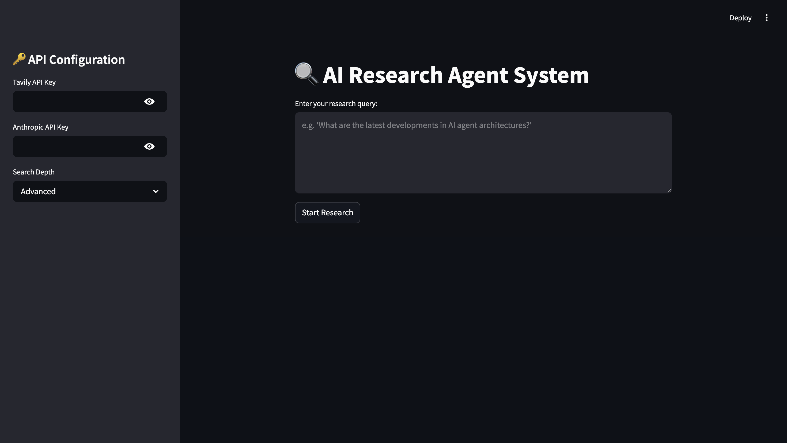

# AI Research Agent System

A powerful agentic research tool that uses LangGraph's multi-agent architecture and Tavily's search capabilities to perform deep web research and generate comprehensive answers.

 research system with:
1. **Research Agent** - Uses Tavily to perform deep web searches and data collection
2. **Answer Drafting Agent** - Synthesizes findings into coherent responses

The system is built using LangGraph for agent orchestration, LangChain for LLM integration, and Streamlit for the user interface.

## Features

- **Deep Web Research** - Utilizes Tavily's search API for comprehensive information gathering
- **Multi-Agent Architecture** - Separates research and synthesis responsibilities
- **LLM-Powered Analysis** - Leverages Claude AI models to understand and process information
- **Configurable Search Depth** - Adjust research parameters based on query complexity
- **User-Friendly Interface** - Simple Streamlit UI for query input and result display

## File Structure

```
ai-research-agent/
├── agents/                       # Agent implementations
│   ├── __init__.py
│   ├── research_agent.py         # Research agent using Tavily
│   └── answer_drafter.py         # Answer synthesis agent
├── tools/                        # External tool integrations
│   ├── __init__.py
│   └── web_search.py             # Tavily API integration
├── app.py                        # Streamlit interface
├── workflow.py                   # LangGraph workflow definition
├── main.py                       # Main application logic
├── config.py                     # Configuration management
├── requirements.txt              # Project dependencies
├── assets/                       # Images and resources
│   └── research-agent-screenshot.png  # UI screenshot
└── README.md                     # Project documentation
```

## Installation

1. Clone this repository
```bash
git clone https://github.com/yourusername/ai-research-agent.git
cd ai-research-agent
```

2. Create a virtual environment
```bash
python -m venv env
source env/bin/activate  # Linux/Mac
env\Scripts\activate     # Windows
```

3. Install dependencies
```bash
pip install -r requirements.txt
```

## Required API Keys

This application requires two API keys:
- [Tavily API Key](https://tavily.com/) for web search capabilities
- [Anthropic API Key](https://www.anthropic.com/) for Claude AI models

## Usage

1. Run the Streamlit application
```bash
streamlit run app.py
```

2. Enter your API keys in the sidebar
3. Type your research query in the main text area
4. Select the desired search depth
5. Click "Start Research" and wait for results

## Implementation Details

### Core Components

#### Research Agent (`agents/research_agent.py`)
```python
from langchain.agents import AgentExecutor
from langchain.agents.format_scratchpad import format_log_to_str
from langchain_core.prompts import ChatPromptTemplate
from langchain_core.runnables import RunnablePassthrough
from langchain_anthropic import ChatAnthropic
from langgraph.prebuilt import ToolNode
from tools.web_search import TavilyTools

class ResearchAgent:
    def __init__(self):
        self.llm = ChatAnthropic(
            model="claude-3-haiku-20240307",
            temperature=0
        )
        self.tools = TavilyTools().web_search
        
    def create(self):
        prompt = ChatPromptTemplate.from_messages([
            ("system", "You're a research specialist. Given: {input}"),
            ("human", "Always use web_search tool. Analyze and collect relevant data.")
        ])
        
        agent = (
            RunnablePassthrough.assign(
                input=lambda x: x["input"],
                scratchpad=lambda x: format_log_to_str(x["intermediate_steps"])
            )
            | prompt
            | self.llm.bind_tools([self.tools])
            | ToolNode([self.tools])
        )
        
        return AgentExecutor(agent=agent, tools=[self.tools])
```

#### Answer Drafter (`agents/answer_drafter.py`)
```python
from langchain.schema import SystemMessage
from langchain_anthropic import ChatAnthropic

class AnswerDrafter:
    def __init__(self):
        self.llm = ChatAnthropic(
            model="claude-3-opus-20240229",
            temperature=0.3
        )
        
    def draft(self, research_data: str):
        return self.llm.invoke([
            SystemMessage(content="Synthesize this into a structured answer:"),
            research_data
        ]).content
```

#### Workflow Orchestration (`workflow.py`)
```python
from langgraph.graph import StateGraph, END
from typing import TypedDict, Annotated, List
from agents.research_agent import ResearchAgent
from agents.answer_drafter import AnswerDrafter

class ResearchState(TypedDict):
    input: str
    research_data: Annotated[List[str], lambda x, _: x.extend(_)]
    answer: str

def build_workflow():
    workflow = StateGraph(ResearchState)
    
    # Initialize agents
    researcher = ResearchAgent().create()
    drafter = AnswerDrafter()
    
    # Define nodes
    def research_node(state):
        result = researcher.invoke({"input": state["input"]})
        return {"research_data": [result["output"]]}
    
    def draft_node(state):
        answer = drafter.draft("\n".join(state["research_data"]))
        return {"answer": answer}
    
    # Build graph
    workflow.add_node("research", research_node)
    workflow.add_node("draft", draft_node)
    
    workflow.set_entry_point("research")
    workflow.add_edge("research", "draft")
    workflow.add_edge("draft", END)
    
    return workflow.compile()
```

#### Tavily Integration (`tools/web_search.py`)
```python
from tavily import TavilyClient
from langchain.tools import tool
import os

class TavilyTools:
    def __init__(self):
        self.client = TavilyClient(api_key=os.environ.get("TAVILY_API_KEY"))

    @tool
    def web_search(self, query: str) -> list:
        """Perform deep web search using Tavily"""
        return self.client.search(
            query=query,
            search_depth="advanced",
            include_answer=True,
            max_results=5
        ).get('results', [])
```

#### Streamlit Interface (`app.py`)
```python
import streamlit as st
from main import run_research
import time
import os

# Configure page
st.set_page_config(
    page_title="AI Research Agent",
    page_icon="🔍",
    layout="centered"
)

# Sidebar for API configuration
with st.sidebar:
    st.title("🔑 API Configuration")
    tavily_key = st.text_input("Tavily API Key", type="password")
    anthropic_key = st.text_input("Anthropic API Key", type="password")
    search_depth = st.selectbox("Search Depth", ["Basic", "Advanced"], index=1)

# Main interface
st.title("🔍 AI Research Agent System")
query = st.text_area("Enter your research query:", 
                    height=150,
                    placeholder="e.g. 'What are the latest developments in AI agent architectures?'")

if st.button("Start Research"):
    if not all([tavily_key, anthropic_key]):
        st.error("Please provide both API keys in the sidebar!")
        st.stop()
    
    if not query:
        st.error("Please enter a research query!")
        st.stop()

    # Set API keys as environment variables
    os.environ["TAVILY_API_KEY"] = tavily_key
    os.environ["ANTHROPIC_API_KEY"] = anthropic_key

    # Initialize progress
    progress_bar = st.progress(0)
    status = st.empty()
    
    try:
        # Simulated progress stages
        stages = [
            ("Initializing research agent...", 10),
            ("Searching web resources...", 25),
            ("Analyzing findings...", 45),
            ("Synthesizing answer...", 75),
            ("Finalizing report...", 100)
        ]

        result = None
        with st.spinner("Processing your request..."):
            # Run research system
            result = run_research(query)
            
            # Update progress
            for stage_text, progress in stages:
                progress_bar.progress(progress)
                status.text(f"Status: {stage_text}")
                time.sleep(1)  # Simulate processing time

        # Display results
        st.success("✅ Research Complete!")
        st.subheader("Research Report")
        st.markdown(result)
        
        # Add download option
        st.download_button(
            label="Download Report",
            data=result,
            file_name="research_report.md",
            mime="text/markdown"
        )

    except Exception as e:
        st.error(f"Research failed: {str(e)}")
```

## How to Add the Screenshot to README

1. Create an `assets` directory in your project
```bash
mkdir -p assets
```

2. Save the screenshot in the assets directory
```bash
# Save your screenshot as research-agent-screenshot.png in the assets directory
```

3. Reference the image in your README.md file using:
```markdown

```

## Dependencies

```
streamlit>=1.33.0
langchain>=0.3.24
langchain-core>=0.3.55
langgraph>=0.3.34
langchain-anthropic>=0.3.3
anthropic>=0.25.2
tavily-python>=0.3.7
```

## License

This project is licensed under the MIT License - see the LICENSE file for details.

